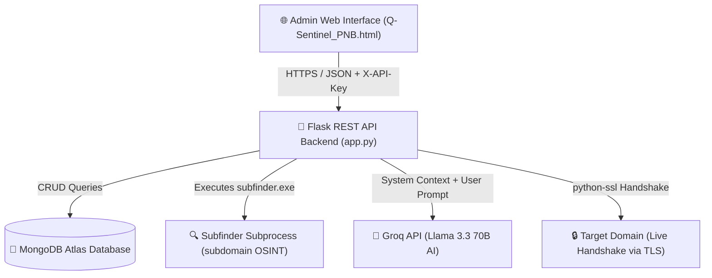
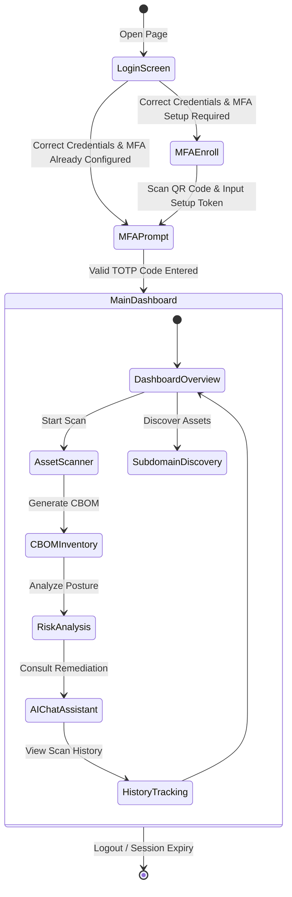
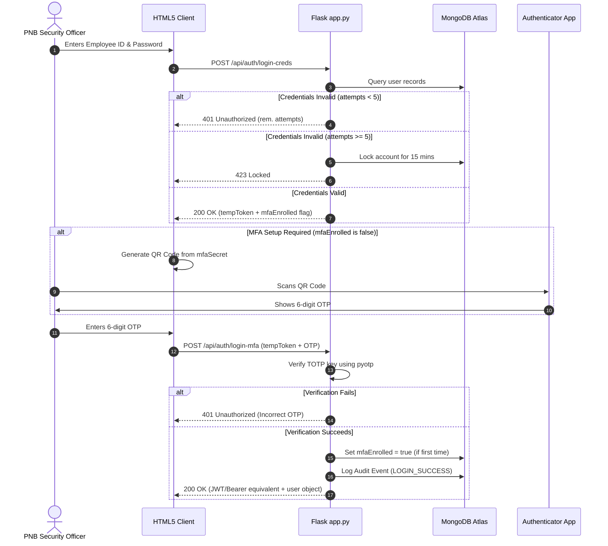
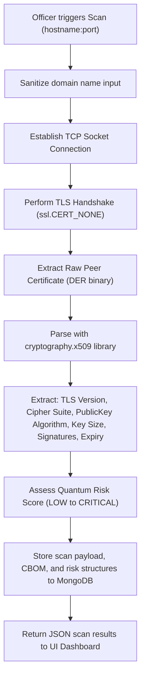

# Q-Sentinel — Ultimate Evaluator Documentation & Guide

> **Prototype Version:** v1.0  
> **Team:** VectorX  
> **Event:** PNB Hackathon 2026  
> **Theme:** Post-Quantum Cryptographic (PQC) Risk Detection & Assessment Platform for Enterprise Banking Infrastructure (Punjab National Bank)  

---

## 🎥 Walkthrough Video & Demo

For a comprehensive video demonstration showing the installation, MFA setup, network scanner, AI remediation assistant, and database states in action, please watch the recording:

https://github.com/Tharunn-09/Q-Sentinel/blob/main/screen-recording-2026-07-31-210824_iJhbxuON.mp4

---

## Table of Contents
0. [Walkthrough Video & Demo](#-walkthrough-video--demo)
1. [Executive Summary & High-Level Architecture](#1-executive-summary--high-level-architecture)
2. [Problem Statement & The Quantum Threat](#2-problem-statement--the-quantum-threat)
3. [System Architecture & Visual Workflows](#3-system-architecture--visual-workflows)
    - [System Component Interaction](#system-component-interaction)
    - [Interactive UI & User State Navigation](#interactive-ui--user-state-navigation)
    - [Authentication, MFA (TOTP) & Password Reset Lifecycles](#authentication-mfa-totp--password-reset-lifecycles)
    - [TLS Handshake & PQC Assessment Pipeline](#tls-handshake--pqc-assessment-pipeline)
4. [Deep-Dive: How Each Phase Works Under the Hood](#4-deep-dive-how-each-phase-works-under-the-hood)
    - [Phase 1: Live TLS Handshake & Certificate Extraction](#phase-1-live-tls-handshake--certificate-extraction)
    - [Phase 2: CBOM (Cryptographic Bill of Materials) Inventory Compilation](#phase-2-cbom-cryptographic-bill-of-materials-inventory-compilation)
    - [Phase 3: SSL Grading & Quantum Risk Score Algorithms](#phase-3-ssl-grading--quantum-risk-score-algorithms)
    - [Phase 4: Subdomain Discovery Subprocess & OSINT Fallback](#phase-4-subdomain-discovery-subprocess--osint-fallback)
    - [Phase 5: Context-Injected AI Remediation Engine](#phase-5-context-injected-ai-remediation-engine)
5. [Database Architecture & MongoDB Atlas Schema](#5-database-architecture--mongodb-atlas-schema)
6. [Audit Logging & Security Controls](#6-audit-logging--security-controls)
7. [Installation & Setup Guide](#7-installation--setup-guide)
8. [Testing & Verification Protocol (REST API & UI)](#8-testing--verification-protocol-rest-api--ui)
9. [Scope, Limitations, and Production Roadmap](#9-scope-limitations-and-production-roadmap)

---

## 1. Executive Summary & High-Level Architecture

**Q-Sentinel** is a secure, post-quantum readiness audit intelligence platform tailored for Punjab National Bank (PNB). It scans public-facing network services, inventories the cryptographic algorithms in use, automatically builds a **Cryptographic Bill of Materials (CBOM)**, assesses migration risks relative to NIST Post-Quantum Cryptography standards, and provides interactive, context-injected remediation plans powered by LLMs.

### Tech Stack Summary
* **Frontend:** Single-page dashboard ([Q-Sentinel_PNB.html](file:///d:/New%20folder/Qs%20Final/Q-Sentinel_PNB.html)) utilizing vanilla JavaScript, HTML5, and premium CSS custom variables (designed in PNB's corporate red and gold color palette).
* **Backend:** Flask-based API ([app.py](file:///d:/New%20folder/Qs%20Final/app.py)) written in Python 3.10+ providing modular routes for scanning, authentication, CBOM compiling, and report exportation.
* **Database:** MongoDB Atlas Cloud Database ([database_mongo.py](file:///d:/New%20folder/Qs%20Final/database_mongo.py)) storing scan runs, compliance postures, host history, and user credentials.
* **AI Engine:** Groq API using Llama 3.3 70B (Versatile model) injected with live network scanning context.
* **Discovery Subprocess:** ProjectDiscovery Subfinder binary for passive OSINT subdomain mapping.

---

## 2. Problem Statement & The Quantum Threat

Classical public-key cryptography (RSA, Elliptic Curve Cryptography like ECDSA, Diffie-Hellman) relies on the computational difficulty of mathematical problems like integer factorization and discrete logarithms. **Shor's Algorithm** running on a sufficiently large quantum computer (a **Cryptanalytically Relevant Quantum Computer** or **CRQC**) can solve these problems in polynomial time, rendering modern asymmetric encryption, signatures, and key exchanges obsolete.

Additionally, adversaries are actively performing **"Harvest Now, Decrypt Later"** attacks—capturing encrypted network traffic today to store and decrypt once CRQCs become commercially available. In 2024, NIST finalized its first standardized PQC algorithms (including ML-KEM/Kyber for key exchange, ML-DSA/Dilithium, and FN-DSA/Falcon for digital signatures). Q-Sentinel allows enterprise teams to instantly locate weak classical algorithms (like RSA 2048 or ECC curves) and establish concrete migration timelines to mitigate the quantum threat.

---

## 3. System Architecture & Visual Workflows

### System Component Interaction



---

### Interactive UI & User State Navigation

Below are the state transitions of the frontend user interface:



---

### Authentication, MFA (TOTP) & Password Reset Lifecycles



---

### TLS Handshake & PQC Assessment Pipeline



---

## 4. Deep-Dive: How Each Phase Works Under the Hood

### Phase 1: Live TLS Handshake & Certificate Extraction

When a scan is triggered:
1. **Socket Setup:** The backend initiates a standard raw TCP socket using `socket.create_connection((hostname, port), timeout=10)`.
2. **Context Configuration:** An `ssl.SSLContext` is initialized. To support auditing of all network nodes (such as dev environments, sandbox portals, or internal hosts with self-signed certs), we disable validation:
   ```python
   context = ssl.create_default_context()
   context.check_hostname = False
   context.verify_mode = ssl.CERT_NONE
   ```
3. **Wrapper Handshake:** The TCP socket is wrapped: `sslsock = context.wrap_socket(sock, server_hostname=hostname)`. A TLS handshake is negotiated.
4. **DER Extraction:** The raw certificate is pulled in binary Distinguished Encoding Rules (DER) format: `der_cert = sslsock.getpeercert(binary_form=True)`.
5. **Object Parsing:** The binary DER certificate is deserialized using Python's `cryptography` library:
   ```python
   cert = x509.load_der_x509_certificate(der_cert, default_backend())
   ```
6. **Parameter Resolution:** We extract:
   * **Subject/Issuer:** Common Name, Organization, Country details.
   * **Serial Number:** Unique certificate identifier.
   * **Key Exchange Strength:** Curve details (e.g. `secp256r1`) or exchange bits.
   * **Public Key Algorithm:** The class of the public key is matched (e.g. `isinstance(pubkey, rsa.RSAPublicKey)`).
   * **Key Size:** Bit length of the public key (e.g. 2048, 4096).

---

### Phase 2: CBOM (Cryptographic Bill of Materials) Inventory Compilation

A **CBOM** acts like a Software Bill of Materials (SBOM) but specifically lists the cryptographic posture of your services. When a scan compiles, the backend creates a structured inventory document mapping:
* **Assets:** Hostnames, ports, and associated IP addresses.
* **Component Algorithms:** Active asymmetric algorithms (e.g., RSA, ECDSA), symmetric block ciphers (e.g., AES-GCM, 3DES), and hashing/MAC algorithms (e.g., SHA-256, SHA-384).
* **Protocol Versions:** TLS 1.0, 1.1, 1.2, 1.3, or SSLv3.
* **Validity State:** Expiration date, days remaining, and key status.
* **PQC Migration Readiness:** An indicator flagging whether the algorithm/key combination is vulnerable to quantum decryptions (classical) or supports post-quantum algorithms.

---

### Phase 3: SSL Grading & Quantum Risk Score Algorithms

The rating engine applies strict heuristics to generate two independent metrics: **SSL Grade** and **Quantum Risk Level**.

#### 1. SSL Grade Calculation
* **Grade F:** If the certificate is expired, or key size is $< 1024$ bits, or outdated protocols (SSLv2, SSLv3, TLS 1.0) are utilized.
* **Grade C:** If the handshake utilizes TLS 1.1.
* **Grade B:** If the handshake utilizes TLS 1.2 but lacks modern cipher configurations.
* **Grade A+:** Handshake utilizes TLS 1.3, public key is RSA $\ge$ 2048 bits or Elliptic Curve $\ge$ 256 bits, and certificate validity remains $> 30$ days.

#### 2. Quantum Risk Score Calculation

```
Handshake Parameters
       │
       ├─► Outdated TLS (1.0/1.1) or weak cipher (RC4/3DES) or Key Size <= 1024-bit? ──► [ CRITICAL RISK ]
       │
       ├─► Cipher is CBC Mode or Key Size <= 2048-bit? ─────────────────────────────────► [ HIGH RISK ]
       │
       ├─► RSA Key Size <= 3072-bit or ECC Curve (secp256r1)? ──────────────────────────► [ MODERATE RISK ]
       │
       └─► TLS 1.3, AEAD Cipher (AES-GCM/ChaCha20), RSA >= 4096-bit? ───────────────────► [ LOW RISK ]
```

---

### Phase 4: Subdomain Discovery Subprocess & OSINT Fallback

To map the external network boundary, Q-Sentinel contains a subdomain discovery engine:
1. **Subprocess Invocation:** The backend attempts to run ProjectDiscovery's `subfinder` command:
   ```bash
   subfinder -d target.com -silent -o output.txt
   ```
2. **Asynchronous Reading:** The backend spawns the process, monitors execution, reads line-by-line outputs, and deletes temporary files.
3. **Passive OSINT Fallback:** If `subfinder` is not installed or configured, the system gracefully defaults to querying certificate transparency logs:
   * It sends a request to `https://crt.sh/?q=%.target.com&output=json`.
   * It parses the returned JSON records, extracts unique common names/identities, and compiles the subdomain inventory.
4. **Sensitive Subdomain Flagging:** Resolved entries matching strings like `vpn`, `mail`, `api`, `admin`, `db`, `portal`, `router` are flagged as **High Priority** in the UI.

---

### Phase 5: Context-Injected AI Remediation Engine

Unlike generic chat models, Q-Sentinel uses **in-context learning**:
1. When a user asks the assistant a question, the frontend sends the user's prompt along with the current scanned host metrics.
2. The backend dynamically constructs a **System Prompt** loaded with these parameters:
   ```
   You are a Post-Quantum Cryptography expert helping a user secure their web assets.
   You are currently analyzing this asset: pnbindia.in (Port: 443)
   Risk Level: HIGH
   Algorithm: RSA (2048-bit)
   Signature Algorithm: sha256WithRSAEncryption
   Protocol: TLSv1.2
   Cipher: ECDHE-RSA-AES256-GCM-SHA384
   Provide a concise, helpful, and highly technical answer based on these exact facts.
   ```
3. This payload is dispatched to the **Groq Llama 3.3 70B** model. The AI provides detailed, specific code configuration suggestions (e.g., how to disable CBC ciphers in Nginx, how to configure hybrid keys, or how to upgrade cipher suites).

---

## 5. Database Architecture & MongoDB Atlas Schema

Below are the primary MongoDB collection layouts:

### 1. `users` Collection
Stores user profile information, password hashes, and MFA secrets.
```json
{
  "_id": {"$oid": "603d..."},
  "employeeId": "PNB-AGT-1042",
  "name": "Security Admin",
  "email": "admin@pnb.co.in",
  "password": "sha256_hashed_string",
  "mfaSecret": "BASE32_TOTP_SECRET_KEY",
  "mfaEnrolled": true,
  "status": "active",
  "loginAttempts": {
    "count": 0,
    "lockUntil": null
  },
  "otp": {
    "code": "123456",
    "expiresAt": "2026-07-31T15:20:00Z"
  }
}
```

### 2. `scans` Collection
Contains full TLS scan payloads, public key specifications, and certificate timelines.
```json
{
  "_id": {"$oid": "603e..."},
  "hostname": "pnbindia.in",
  "port": 443,
  "ipAddress": "121.241.242.45",
  "timestamp": "2026-07-31T15:10:00Z",
  "tlsVersion": "TLSv1.2",
  "cipherSuite": "ECDHE-RSA-AES256-GCM-SHA384",
  "sslGrade": "B",
  "quantumRisk": "HIGH",
  "certificate": {
    "subject": "CN=*.pnbindia.in, O=Punjab National Bank...",
    "issuer": "CN=DigiCert Global G2...",
    "serialNumber": "1537294829104...",
    "validFrom": "2026-01-01T00:00:00",
    "expiry": "2027-01-01T23:59:59",
    "daysLeft": 154
  },
  "keyExchange": {
    "type": "ECDH",
    "curve": "secp256r1",
    "strength": 128
  },
  "publicKey": {
    "algorithm": "RSA",
    "size": 2048
  }
}
```

### 3. `audit_logs` Collection
Tracks authentication events, resets, and target scans.
```json
{
  "_id": {"$oid": "603f..."},
  "employeeId": "PNB-AGT-1042",
  "action": "SCAN_EXECUTED",
  "ipAddress": "127.0.0.1",
  "details": "Triggered TLS Scan on pnbindia.in:443",
  "timestamp": "2026-07-31T15:10:05Z"
}
```

---

## 6. Audit Logging & Security Controls

To ensure compliance with corporate banking policies, Q-Sentinel tracks actions using audit logs. The system records the actor's Employee ID, source IP address, action type, and details.

### Tracked Audit Actions:
1. `CREDS_VERIFICATION_SUCCESS`: Credentials checked, waiting for MFA code.
2. `LOGIN_FAILED`: Erroneous credentials submitted.
3. `LOGIN_SUCCESS`: Sign-in completed successfully.
4. `ACCOUNT_LOCKED`: Automatically locked out for 15 minutes after 5 sequential failures.
5. `MFA_ENROLLED`: Completed initial setup of TOTP device.
6. `PASSWORD_RESET_OTP_SENT`: Email reset OTP issued.
7. `PASSWORD_RESET_SUCCESS`: Reset verified and credentials updated.
8. `SCAN_EXECUTED`: A live network scan was performed.

---

## 7. Installation & Setup Guide

### 1. Prerequisites
- **Python 3.10 or higher** installed.
- **MongoDB Atlas account** (or a local MongoDB instance).
- **Groq API Key** (optional, fallback defaults are provided).
- **Subfinder Binary** (optional, fallback script queries `crt.sh` automatically).

### 2. Installation Steps

1. **Extract/Clone the repository** to your local machine.
2. **Navigate into the directory**:
   ```bash
   cd "d:\New folder\Qs Final"
   ```
3. **Install dependencies**:
   ```bash
   pip install -r requirements.txt
   ```

### 3. Database Connection Setup
Open [database_mongo.py](file:///d:/New%20folder/Qs%20Final/database_mongo.py) and update `MONGO_URI` with your connection details:
```python
MONGO_URI = "mongodb+srv://<username>:<password>@<cluster-url>/?retryWrites=true&w=majority"
```
Ensure your MongoDB Atlas Network Access rules permit connections from your local machine's IP (or set it to `0.0.0.0/0` temporarily).

### 4. Groq API Setup (Optional)
The system has a pre-configured Groq API key in `app.py` for immediate use. If you want to use your own:
- On Linux/macOS:
  ```bash
  export GROQ_API_KEY="your_groq_api_key"
  ```
- On Windows (PowerShell):
  ```powershell
  $env:GROQ_API_KEY="your_groq_api_key"
  ```

### 5. Running the Backend Server
Start the Flask application:
```bash
python app.py
```
The console will output:
```
=======================================================
  Q-Sentinel v1.0 Backend + Groq AI
  URL : http://localhost:5004
=======================================================
```

### 6. Opening the Dashboard
Since the frontend is a client-side web app, you can simply double-click and open the file [Q-Sentinel_PNB.html](file:///d:/New%20folder/Qs%20Final/Q-Sentinel_PNB.html) in any modern browser.

---

## 8. Testing & Verification Protocol (REST API & UI)

### 1. Credentials for Evaluators
To test authentication, use the default administrator credentials:
* **Employee / Agent ID:** `admin`
* **Password:** `qsentinel2026`

Upon entering credentials, you will be prompted to scan a **QR Code** using any authenticator app (like Google Authenticator, Microsoft Authenticator, or Bitwarden). Enter the 6-digit verification code to complete sign-in.

---

### 2. REST API Verification Commands

You can verify the backend endpoints are online and functioning using `curl` commands in your terminal:

#### 1. Backend Health Check
```bash
curl -i http://localhost:5004/health
```
* **Expected Output:** `200 OK` with JSON `{"status":"ok", "service":"Q-Sentinel Backend Online"}`

#### 2. Trigger TLS Scan (Target: google.com)
```bash
curl -i -X POST http://localhost:5004/scan \
  -H "Content-Type: application/json" \
  -H "X-API-Key: qsentinel-team-vectorx-2026" \
  -d "{\"hostname\": \"google.com\", \"port\": 443}"
```
* **Expected Output:** `200 OK` with a detailed JSON object containing `tlsVersion`, `cipherSuite`, `sslGrade`, `quantumRisk`, and `publicKey` specifications.

#### 3. Subdomain Discovery (Target: ucoonline.co.in)
```bash
curl -i -X GET "http://localhost:5004/api/subfinder-subdomains?hostname=ucoonline.co.in" \
  -H "X-API-Key: qsentinel-team-vectorx-2026"
```
* **Expected Output:** `200 OK` with JSON array containing resolved subdomains for the target.

---

## 9. Scope, Limitations, and Future Roadmap

### Prototype Scope
* **Live Scanning:** Executes actual handshakes on any hostname/port combo.
* **Risk Categorization:** Maps traditional cryptographic weaknesses to Post-Quantum equivalents.
* **CBOM Exporter:** Exports standardized cryptographic bills of materials in JSON.
* **Security & MFA:** Full database-driven login session management with TOTP MFA.

### Limitations (Hackathon Context)
* **Real-time PQC handshake:** Most public servers do not support actual Post-Quantum algorithms (e.g., ML-KEM) at this stage. Hence, the tool detects vulnerable classical ciphers and flags them, simulating future mitigation needs.
* **Security API Key:** The communication between frontend and backend uses a static `X-API-Key` header (`qsentinel-team-vectorx-2026`). In production, this would be swapped for stateful JWT bearer tokens.
* **Subfinder Binary:** Subdomain enumeration relies on the `subfinder` command. If it is not present in the system environment, the platform automatically fails-safe to an OSINT web-API fallback.

### Future Roadmap
1. **Hybrid Key Exchange Scanning:** Support scanning for experimental PQ/T (Post-Quantum/Traditional Hybrid) key exchange mechanisms (e.g., X25519+Kyber768).
2. **Automated Rescans & Alerts:** Set up automated cron jobs to regularly scan active inventory and send notifications (Slack, Teams, Email) if an asset's risk score changes.
3. **PQC Cryptographic Code Audits:** Analyze codebases and configuration files directly (via CI/CD plugins) to build static CBOMs in addition to network-based dynamic CBOMs.

---

*“Q-Sentinel — Built for the quantum-safe future.”*